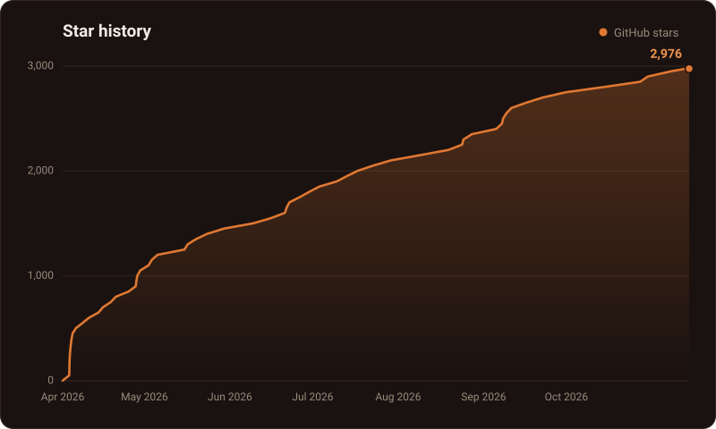

# SnapOtter

A free, self-hosted toolbox for images, videos, audio, and PDFs. Run it on your own computer or server, and your files stay there.

[Try the live demo](https://demo.snapotter.com) · [Documentation](https://docs.snapotter.com/guide/getting-started)

## Install

1. Install [Docker Desktop](https://www.docker.com/products/docker-desktop/) and open it.
2. Run this in a terminal:

   ```bash
   docker run -d --name SnapOtter -p 1349:1349 -v SnapOtter-data:/data snapotter/snapotter:latest
   ```

3. Open [http://localhost:1349](http://localhost:1349) and log in with `admin` / `admin`. You'll be asked to set a new password.

For Docker Compose, production setups, and GPU acceleration, see the [deployment guide](https://docs.snapotter.com/guide/deployment).

## What it does

- **Images:** resize, compress, convert, remove backgrounds, watermark
- **Video:** convert, compress, trim, extract audio
- **Audio:** convert, trim, normalize, transcribe
- **PDFs:** merge, split, compress, protect, OCR
- **Files:** CSV, JSON, and Excel conversion

## Privacy

Your files stay on your machine. Basic analytics are on by default to help us find bugs. You can turn them off in the admin settings. [Details](https://docs.snapotter.com/guide/telemetry).

## Contributing

We welcome bug reports, feature ideas, and pull requests. See [CONTRIBUTING.md](CONTRIBUTING.md) for the full guide, or jump in:

- [Open an issue](https://github.com/snapotter-hq/snapotter/issues)
- [Submit a PR](CONTRIBUTING.md#code-requires-cla)
- [Join Discord](https://discord.gg/hr3s7HPUsr) for help and discussion
- [Sponsor the project](https://github.com/sponsors/snapotter-hq) to keep SnapOtter free for everyone

## Support SnapOtter

SnapOtter is built and maintained independently with no venture capital or corporate backing. Sponsorships fund infrastructure, keep releases flowing, and ensure the project stays free and open for everyone.

If SnapOtter has replaced a paid subscription or two in your workflow, a small sponsorship helps keep it that way:

<a href="https://github.com/sponsors/snapotter-hq">
  
</a>

<!-- sponsors -->
<p align="center">
  SnapOtter is free and open source, made possible by the people below.
</p>

<p align="center">
  <a href="https://github.com/kkwpsi"></a>
  <a href="https://github.com/highb"></a>
  <a href="https://github.com/CSP-Tom"></a>
  <a href="https://github.com/dominic427"></a>
</p>

<p align="center">
  <a href="https://github.com/kkwpsi">@kkwpsi</a> &nbsp;&middot;&nbsp; <a href="https://github.com/highb">@highb</a> &nbsp;&middot;&nbsp; <a href="https://github.com/CSP-Tom">@CSP-Tom</a> &nbsp;&middot;&nbsp; <a href="https://github.com/dominic427">@dominic427</a>
</p>
<!-- sponsors -->

<p align="center">
  <a href="https://github.com/snapotter-hq/SnapOtter/stargazers">
    
  </a>
</p>

## License

This project is dual-licensed under the [AGPLv3](LICENSE) and a commercial license.

- **AGPLv3 (free):** You may use, modify, and distribute this software under the AGPLv3. If you run a modified version as a network service, you must make your source code available under the AGPLv3.
- **Commercial license (paid):** For use in proprietary software or SaaS products where AGPLv3 source-disclosure is not suitable, a commercial license is available. [Contact us](mailto:contact@snapotter.com) for pricing and terms.

See [LICENSING.md](LICENSING.md) for full details on the open-core boundary between AGPLv3 and commercial code.
